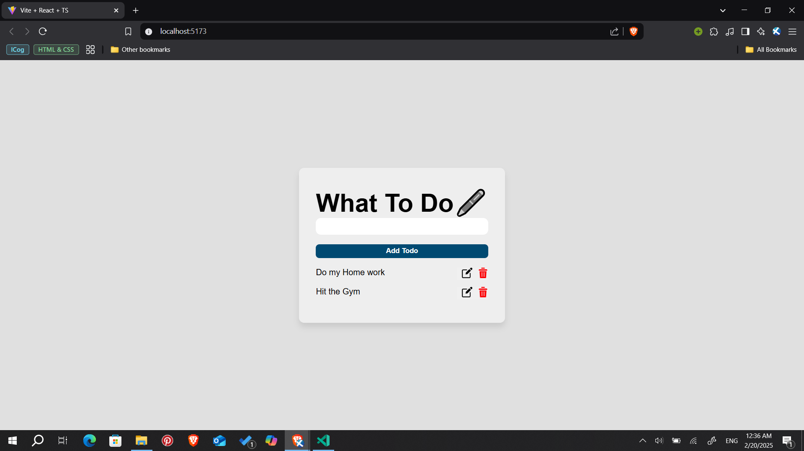
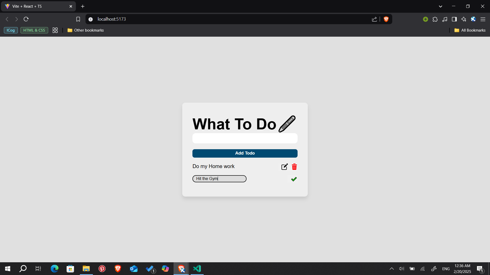

# React + TypeScript Todo App

A simple and elegant Todo App built using **React**, **TypeScript**, and **Vite**. This app allows users to manage daily tasks with basic functionality like adding, completing, and deleting tasks — all based on a hardcoded task list.

---

## Features

- View a list of tasks
- Add new tasks
- Mark tasks as completed
- Delete tasks
- Different styling for completed tasks

---

## Technologies Used

- [React](https://reactjs.org/)
- [TypeScript](https://www.typescriptlang.org/)
- [Vite](https://vitejs.dev/)
- [Tailwind CSS](https://tailwindcss.com/) *(if used, optional)*

---

## Getting Started

### 1. Clone the Repository

```bash
git clone https://github.com/Kingestif/gdg_study_session.git
cd "gdg_study_session/Todo App"
```

### 2. Install Dependencies

```bash
npm install
```

### 3. Run the App Locally
```bash
npm run dev
```


### Visuals

